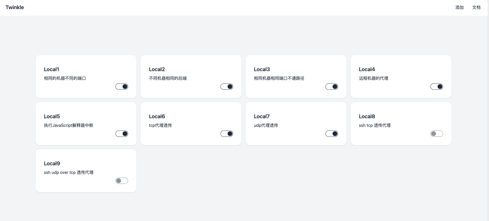

Twinkle
#
这个工具只能开发环境使用 请不要用于生产环境
---
[](https://github.com/Crtrpt/twinkle/actions/workflows/go.yml)
---

执行命令显示帮助信息
```
twinkle -h
```
golang 实现的外网代理回调服务器 主要让外网访问内网api用途

## 运行
```golang
git clone git@github.com:Crtrpt/twinkle.git
cd twinkle
go mod tidy
go run cmd/twinkle/main.go
```

## 流程图


## ssh 代理转发流程图


## 特性
- ssh隧道代理
- 本地代理
- 远程代理

## 问题
- 增加完善的测试用例
- static 安全访问
- ssh不稳定问题 断开的问题
- 文档
- 错误处理的问题
- 增加对udp的支持

## 注意
如果需要sshd远程隧道 需要开启 sshd 隧道功能 否则无法监听外部端口
当前只支持key访问
```
GatewayPorts yes
```

# 配置示例
```
# Twinkle 可以实现多个本地代理和远程代理
# 每个proxy 就是对一个代理的配置
# 如果有ssh 并且ssh的 auth不为空的话 表示是一个 ssh远程代理 否则为本地代理
# 当前的配置为一些配置的示例
[proxy.Local1]
Name = "Local1"
Desc = "相同的机器不同的端口"
# 是否开启代理
Enable = true   
# 要代理的http url
Url = "http://127.0.0.1:8081/api/v1"
# 要代理到的 后端地址
Proxy = "http://127.0.0.1:8088/api/v1.0.0"
# 如果static目录中对应的文件存在的话就输出静态文件 否则请求后端的 返回后端的 请求数据
Root = "./static/"
# 返回给前端的 http header 要动态修改的话 用 Interrupt 设置对应的js文件 通过js动态的设置修改配置
[proxy.Local1.Header]
ServerName = "twinkle"

[proxy.Local2]
Name = "Local2"
Desc = "不同机器相同的后端"
# 是否开启代理
Enable = true   
Url = "http://127.0.0.1:8082/api/v1"
Proxy = "http://127.0.0.1:8088/api/v1.0.0"
Root = "./static/"
[proxy.Local2.Header]
ServerName = "twinkle"

[proxy.Local3]
Name = "Local3"
Desc = "相同机器相同端口不通路径"
# 是否开启代理
Enable = true   
Url = "http://127.0.0.1:8081"
Proxy = "http://127.0.0.1:8088/api/v2.0.0"
Root = "./static/"

[proxy.Local4]
Name = "Local4"
Desc = "远程机器的代理"
# 是否开启代理
Enable = true   
Url = "http://123.249.115.24:8081"
Proxy = "http://127.0.0.1:8088/api/v2.0.0"
Root = "./static/"

[proxy.Local4.ssh]
Auth = "key"
Host = "123.249.115.24:22"
# 是否开启代理
Enable = true   
UserName = "root"
PrivateKey = "./key/id_rsa"
Addr = "http://0.0.0.0:8081"

[proxy.Local5]
Name = "Local5"
Desc = "执行JavaScript解释器中断"
# 是否开启代理
Enable = true   
Url = "http://127.0.0.1:8083"
Proxy = "http://127.0.0.1:8088/api/v2.0.0"
Root = "./static/"
Interrupt ="./hook/round.js"


[proxy.Local6]
Name = "Local6"
Desc = "tcp代理透传"
# 是否开启代理
Enable = true   
Url = "tcp://127.0.0.1:8086"
Proxy = "tcp://127.0.0.1:6379"


[proxy.Local7]
Name = "Local7"
Desc = "udp代理透传"
# 是否开启代理
Enable = true   
Url = "udp://127.0.0.1:8086"
Proxy = "udp://127.0.0.1:9001"
```


## 仪表盘截图
